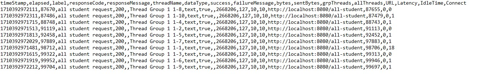
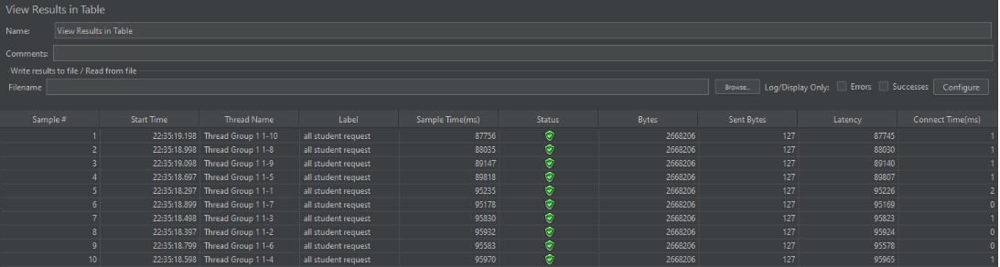
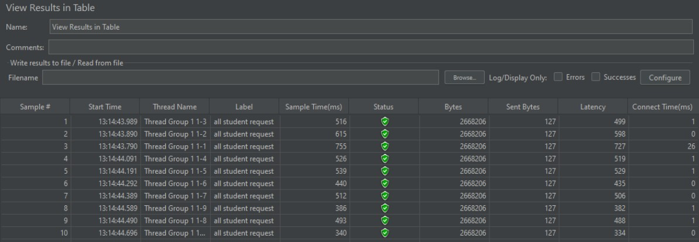
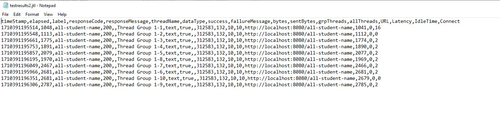
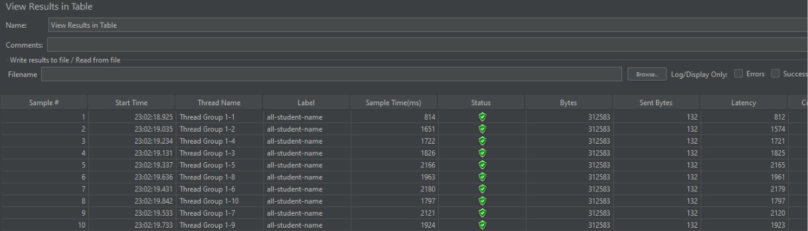
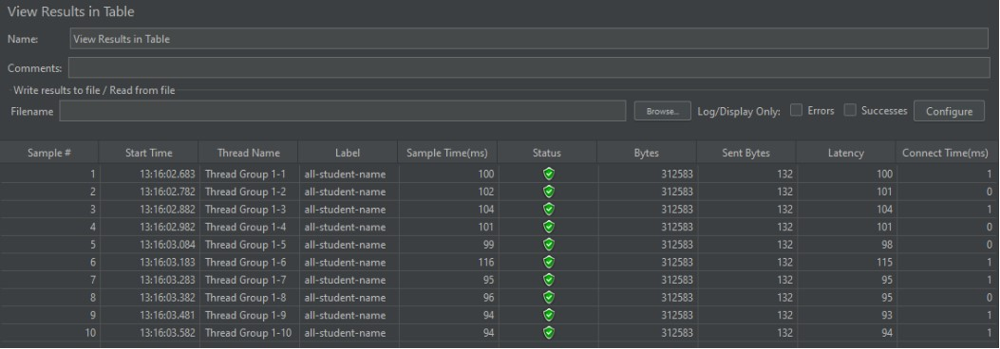
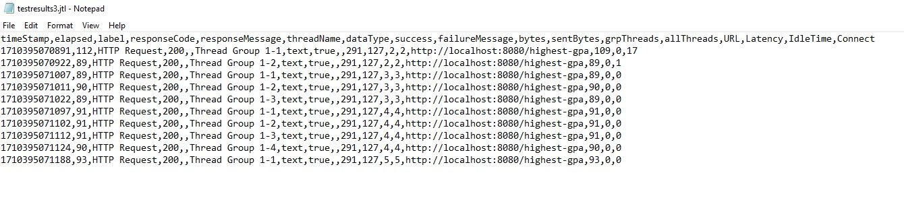
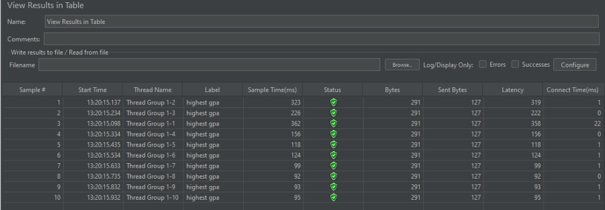
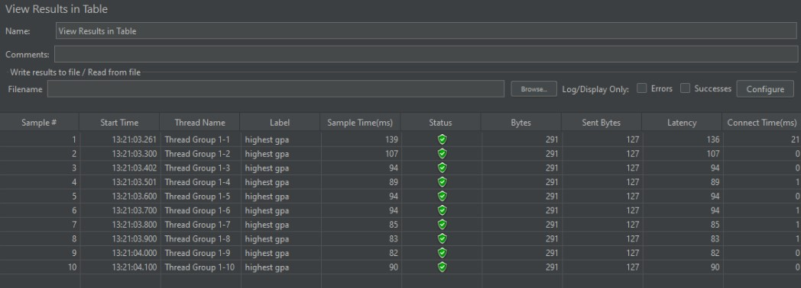

# MODUL 5

### Nama    : Rizqi Bayu Utama
### Kelas   : ADVPRO - B
### NPM     : 2206826330

## REFLECTION
1. What is the difference between the approach of performance testing with JMeter and profiling with IntelliJ Profiler in the context of optimizing application performance?
    - Jawab: Jmeter digunakan untuk mengukur performa aplikasi dengan cara mensimulasikan beban kerja yang tinggi pada aplikasi, sedangkan Profiler digunakan untuk mencari tahu bottleneck pada aplikasi yang menjadi penyebab performa lambat.
   
2. How does the profiling process help you in identifying and understanding the weak points in your application?
    - Jawab: Profiling berguna untuk menemukan bottleneck pada aplikasi yang menyebabkan performa aplikasi menjadi lambat.
   
3. Do you think IntelliJ Profiler is effective in assisting you to analyze and identify bottlenecks in your application code?
    - Jawab: Menurut saya sudah cukup efektif dalam menemukan bottleneck pada aplikasi dengan flame graph yang disediakan oleh Intellij Profiler. Dengan flame graph, kita bisa melihat apa yang membuat performa aplikasi menjadi menurun.
   
4. What are the main challenges you face when conducting performance testing and profiling, and how do you overcome these challenges?
    - Jawab: Hal yang paling menantang adalah melakukan optimisasi setelah menemukan bottleneck pada aplikasi. Untuk mengatasi hal tersebut maka saya melakukan REFACTORING code untuk optimisasi aplikasi.
   
5. What are the main benefits you gain from using IntelliJ Profiler for profiling your application code?
    - Jawab: Main benefit yang saya dapatkan ialah tidak perlu menggunakan software lain untuk melakukan profiling.
   
6. How do you handle situations where the results from profiling with IntelliJ Profiler are not entirely consistent with findings from performance testing using JMeter?
    - Jawab: Jika terjadi inkonsistensi antara Jmeter dan Intellij Profiler, maka hal yang pertama saya lakukan adalah mencari titik permasalahannya lalu mencari solusinya di internet, selanjutnya bertanya teman dan terakhir jika kedua hal tersebut masih kurang maksimal saya akan bertanya ke Tim Asisten dan Dosen.

7. What strategies do you implement in optimizing application code after analyzing results from performance testing and profiling? How do you ensure the changes you make do not affect the application's functionality?
    - Jawab: Hal yang saya lakukan pada optimisasi code adalah sebagai berikut:
        * Mengurangi pemanggilan Database dan menggunakan Hashmap untuk efisiensi pencarian pada ``getAllStudent()``
        * Penggunaan ``Stream`` pada ``findStudentWithHighestGPA()``.
        *  Penggunaan ``StringBuilder`` menggantikan operasi konkatenasi pada ``joinStudentNames()``.

## JMeter Report and Test Results
1. ``/all-student``:
   - Test Result JMeter:
      
   - Before:
   
   - After:
   
   
2. ``/all-student-name``:
   - Test Result JMeter:
   
   - Before:
   
   - After:
   
   
3. ``/highest-gpa``:
   - Test Result JMeter:
   
   - Before:
   
   - After:
   